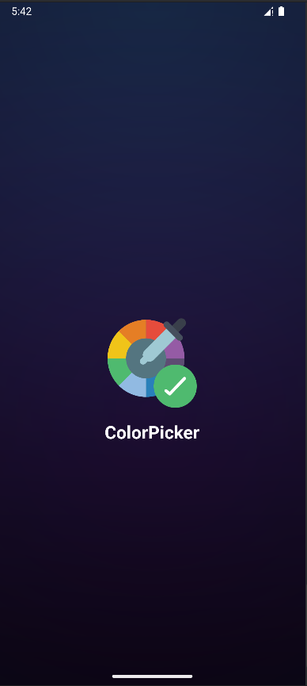
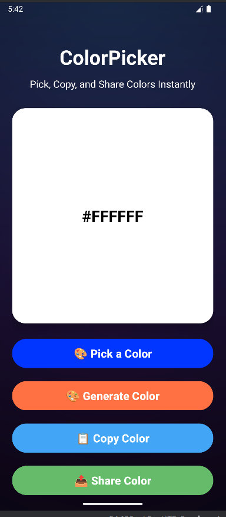
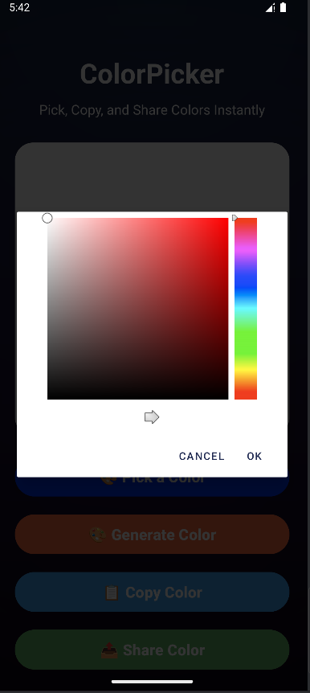
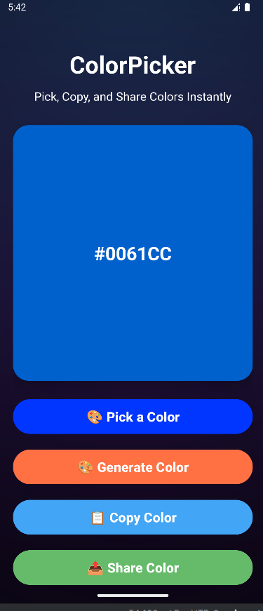
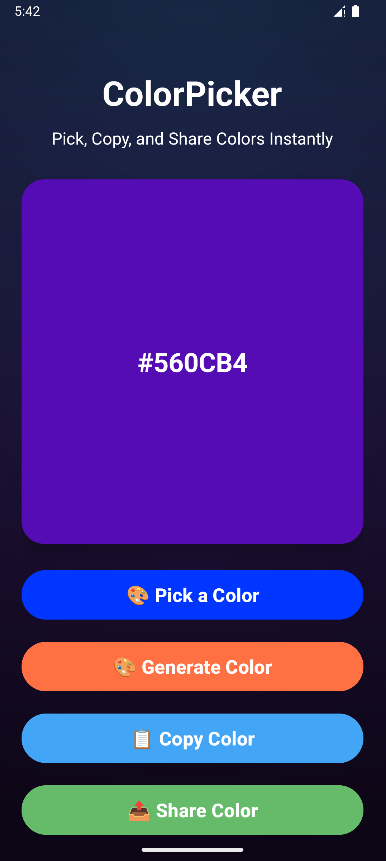

# ColorPicker

ColorPicker is a simple and fun Android app that allows you to generate random colors, pick custom colors from a palette, copy their hex codes, and share them instantly. Perfect for designers, developers, or anyone who loves colors!

---

## Features

- Generate random colors with a single tap.
- Pick custom colors using a full color palette.
- Copy hex codes to the clipboard for use in projects.
- Share colors instantly via other apps.
- Clean and intuitive interface with CardView design.

---

## Screenshots

  
  
  
  
  

---

## How it Works

1. Open the app to see a default color card.
2. Tap **Generate Color** to get a random color.
3. Tap **Pick Custom Color** to open the full color palette.
4. Tap **Copy Color** to copy the hex code to your clipboard.
5. Tap **Share Color** to send the color code to your friends or other apps.

---

## Installation

1. Clone or download the repository.
2. Open the project in **Android Studio**.
3. Sync Gradle to install dependencies.
4. Run the app on an emulator or Android device.

---

## Contact

For any questions or support, reach out to:  
📧 **Email:** rusho.rohan@gmail.com  
🌐 **GitHub:** [github.com/rohan-rusho](https://github.com/rohan-rusho)

---

**Enjoy picking and sharing colors with ColorPicker!**
